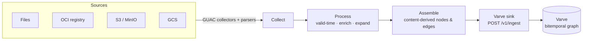

# sluice

[](LICENSE)
[](go.mod)

**sluice** streams software supply-chain metadata — SBOMs, attestations, vulnerability and VEX documents — into [Varve], the bitemporal graph database, as deterministic, content-derived records.

It reuses [GUAC] as a library for collecting and parsing document formats, then replaces everything downstream of parsing: instead of GUAC's own storage, sluice assembles a native property graph and posts it to Varve's `POST /v1/ingest`. The result is a queryable, time-travellable graph of what your software is made of and what is known about it.

[Varve]: https://github.com/ravan/varve
[GUAC]: https://github.com/guacsec/guac

---

## Highlights

- **Multi-source collection** — ingest from local **files**, **OCI** registries (single image or whole registry), **S3**/MinIO buckets, and **GCS** buckets.
- **Deterministic and idempotent** — every node and edge ID is derived from document content, so re-ingesting the same corpus supersedes in place and converges to identical counts. Safe to replay after a crash.
- **Bitemporal** — a document's own timestamp becomes guarded, first-class *valid time* you can query with `FOR VALID_TIME AS OF`. Implausible timestamps are rejected and counted, never silently trusted.
- **Enrichment** — optionally fold OSV vulnerabilities, ClearlyDefined licenses, endoflife.date EOL, and deps.dev scorecard evidence onto a document's packages.
- **Expansion** — optionally pull transitive dependencies from deps.dev as new documents, bounded by a per-run budget.
- **Two front-ends, one pipeline** — a one-shot CLI for batch ingest and a config-driven daemon that watches sources and polls for new documents.
- **Production-shaped** — Prometheus metrics, a health endpoint, transient-failure retries, graceful drain on `SIGTERM`, and bulk ingest proven against a durable object-store-backed Varve.

## How it works

sluice runs a three-stage pipeline. GUAC handles collection and parsing; sluice owns assembly and delivery.



1. **Collect** — GUAC's collectors and format parsers turn source documents (SPDX, CycloneDX, in-toto attestations, …) into GUAC's in-memory model.
2. **Process** — optional, config-gated stages resolve valid time (with a guard and counted fallback), enrich packages with external evidence, and expand transitive dependencies.
3. **Assemble & sink** — each document is mapped to a stream of deterministic records — `PkgName`, `PkgVersion`, `SrcName`, vulnerability and evidence nodes joined by first-class semantic edges (`PkgHasVersion`, `IsDependency`, `IsOccurrence`, `HasSbom`, `CertifyVuln`, `CertifyScorecard`, `HasSourceAt`, …) — and streamed to Varve over `POST /v1/ingest`.

Because IDs are content-derived, the same input always produces the same graph, and an interrupted run heals to the correct state on replay.

## Requirements

- **Go 1.26+** to build.
- A reachable **Varve** instance to ingest into (`--varve-addr`, default `http://127.0.0.1:8080`).
- **[`just`](https://github.com/casey/just)** and **Docker** to run the bundled examples.
- GUAC is vendored as a library at a pinned release (`github.com/guacsec/guac v1.1.0`, Apache-2.0). There is never a `replace` directive.

## Installation

```sh
go install github.com/ravan/sluice/cmd/sluice@latest
```

Or build from source:

```sh
git clone https://github.com/ravan/sluice
cd sluice
go build -o sluice ./cmd/sluice
```

## Quick start

Ingest every document in a directory in a single pass:

```sh
export VARVE_TOKEN=<bearer token>   # required; read from the environment, never a flag, so it never lands in argv
sluice ingest files ./testdata/sboms --varve-addr http://127.0.0.1:8080
```

The command prints a run receipt (`documents=… nodes=… edges=… skipped=…`) and exits non-zero if any document was skipped or the run failed — the receipt is printed first, so committed progress stays visible.

## Usage

### One-shot ingest

Each source kind is a subcommand and shares the same persistent ingest flags:

```sh
sluice ingest files ./sboms
sluice ingest oci   ghcr.io/example/image:tag [--oci-registry] [--oci-insecure]
sluice ingest s3    my-bucket [--s3-url URL] [--s3-region REGION] [--s3-path PREFIX]
sluice ingest gcs   my-bucket
```

- `--oci-registry` collects every image in a registry rather than a single ref; `--oci-insecure` allows plain-HTTP / skips TLS for local registries.
- S3 and GCS credentials come from their SDK default chains (`AWS_ACCESS_KEY_ID` / `AWS_SECRET_ACCESS_KEY` for S3/MinIO, Application Default Credentials for GCS) — never from config or argv.

### Enrichment & expansion

Both are opt-in and default **off**, so CI and offline runs never reach the network:

```sh
sluice ingest files ./sboms \
  --enrich-vulns --enrich-licenses --enrich-eol --enrich-deps-dev \
  --expand-deps-dev --expand-max-docs 25
```

Enrichment folds OSV `CertifyVuln`, ClearlyDefined `CertifyLegal`, endoflife.date `HasMetadata`, and deps.dev `CertifyScorecard` evidence onto the document's packages. Expansion feeds those packages to the in-process deps.dev collector and ingests their transitive dependencies as new documents, up to `--expand-max-docs` (reported as `expanded=N` in the receipt).

### Collector daemon

`sluice run` is the same collect → process → sink pipeline driven by a config file instead of flags. It watches its sources, polls for new documents, and runs until signalled to stop:

```sh
sluice run --config pipeline.yaml
```

It serves Prometheus metrics and `/healthz`, retries transient sink failures, and drains gracefully on `SIGTERM`.

## Configuration

The daemon is configured with a small YAML file (`deploy/pipeline.yaml` is the reference). At least one receiver is required; add a `poll` duration to make a receiver polling (omit it for a single pass). Unknown keys are a load error.

```yaml
receivers:
  files: { path: ./inbox, poll: 5s }
  oci:
    refs: ["ghcr.io/example/image:tag"]  # image refs, or registry hosts when registry: true
    registry: false                      # true ⇒ collect whole registries
    insecure: false                      # plain-HTTP / skip-TLS, for local registries
    poll: 30s
  s3:
    bucket: my-sboms
    url: "http://minio:9000"             # custom endpoint; omit for AWS SDK defaults
    region: us-east-1
    path: sboms/                         # folder prefix (list mode only)
    queues: my-queue                     # required when poll is set (SQS)
    poll: 15s
  gcs:
    bucket: my-sboms                     # needs GCP Application Default Credentials
    poll: 1m

processors:
  valid_time: { floor: "2000-01-01T00:00:00Z", future_skew: 24h }
  enrich:     { vulns: true, licenses: true, eol: true, deps_dev: true }
  expand:     { deps_dev: true, max_docs: 500 }

sink:
  varve:
    addr: http://127.0.0.1:8080
    token_env: VARVE_TOKEN               # name of the env var holding the bearer token — no secret in the file
```

## CLI reference

```
sluice ingest files|oci|s3|gcs <target>   ingest a source in one pass
sluice run --config <file>                run the config-driven collector daemon
sluice bench files <dir>                  assemble a corpus and time one bulk /v1/ingest
sluice version                            print version information
```

**Persistent `ingest` flags** (apply to every source subcommand):

| Flag | Default | Description |
|------|---------|-------------|
| `--varve-addr` | `http://127.0.0.1:8080` | Varve ingest endpoint |
| `--valid-floor` | — | reject valid timestamps before this instant (fall back to ingest time) |
| `--valid-skew` | — | reject valid timestamps this far into the future |
| `--enrich-vulns` | `false` | OSV vulnerability evidence |
| `--enrich-licenses` | `false` | ClearlyDefined license evidence |
| `--enrich-eol` | `false` | endoflife.date end-of-life evidence |
| `--enrich-deps-dev` | `false` | deps.dev scorecard evidence |
| `--expand-deps-dev` | `false` | ingest transitive dependencies from deps.dev |
| `--expand-max-docs` | `500` | per-run expansion budget |

**Source-specific flags:** `--oci-registry`, `--oci-insecure` · `--s3-url`, `--s3-region`, `--s3-path`.

**Daemon (`run`) flags:** `--config` (required) · `--metrics-addr` (default `:9464`, serves `/metrics` and `/healthz`) · `--log-level` (`debug|info|warn|error`, default `info`) · `--log-format` (`json|text`, default `json`).

The `VARVE_TOKEN` environment variable supplies the bearer token for every mode and is required; it is never accepted as a flag.

## Observability

The daemon exposes Prometheus metrics and a health check on `--metrics-addr` (default `:9464`):

| Metric | Description |
|--------|-------------|
| `sluice_documents_total{outcome}` | documents processed, by outcome (`ingested`, `skipped`, `failed`) |
| `sluice_records_emitted_total{kind}` | records emitted to the sink, by node/edge kind |
| `sluice_valid_time_fallbacks_total` | valid timestamps rejected by the guard and fallen back to ingest time |
| `sluice_sink_retries_total` | transient sink failures retried |
| `sluice_expansion_documents_total` | extra documents ingested by deps.dev expansion |

`GET /healthz` returns readiness; `GET /metrics` serves the Prometheus text exposition.

## Examples

The repository ships runnable, self-asserting demonstrations as `just` targets. Each brings up a local Varve stack, exercises a capability end to end, and fails loudly if an invariant is violated. They require Docker and a local Varve image built from a sibling checkout:

```sh
just varve-image   # once: build sluice/varve:local from a sibling Varve checkout (override VARVE_SRC)
```

| Target | What it demonstrates |
|--------|----------------------|
| `just demo` | Ingests the SBOM corpus twice and asserts the graph is byte-identical both times — idempotent supersede-upsert. |
| `just blast-radius` | Answers *"given CVE-2021-44228 (Log4Shell), which shipped images are affected?"* in native GQL — asserts exactly 7 affected and 0 control images. |
| `just valid-time` | Proves valid-time travel (a backdated SBOM present `AS OF 2025-06`, absent `AS OF 2024-01`) and the timestamp guard (an epoch-0 document falls back to ingest time, counted in the receipt). |
| `just collector` | Runs the daemon, drops an SBOM into the watched directory, watches it appear within one poll interval, reads the ingest counters off `/metrics`, and proves a graceful `SIGTERM` drain. |
| `just enrich` | One SBOM in yields a certified neighborhood out — OSV vulnerabilities plus deps.dev source/scorecard facts for transitive dependencies. **Requires live network** to OSV and deps.dev. |
| `just receivers` | Ingests the same SBOM from an OCI local registry and an S3/MinIO bucket, asserting idempotency on each. Requires Docker with `oras` and `mc`. |
| `just benchmark` | Assembles a ~15.7k-record corpus into one deduplicated stream and times a single bulk `/v1/ingest` on a durable Garage/S3-backed Varve, reporting records/s and evidence-edges/s. |
| `just crash-replay` | `kill -9`s an ingest mid-stream, then replays the full corpus and asserts the graph heals to identical counts. |
| `just gallery` | The full-dress run from clean durable volumes: blast-radius, valid-time, benchmark, and crash-replay in sequence. |

Tear any stack down with `just varve-down`. Overrides: `VARVE_IMAGE` (image to run, default `sluice/varve:local`), `VARVE_SRC` (sibling Varve checkout the image builds from), `VARVE_PORT` (host port, default `8080`).

## Development

```sh
just check   # build, vet, gofmt check, and race tests
just lint    # golangci-lint
```

## Limitations

- **GCS is not exercised in the local demos.** The client resolves GCP Application Default Credentials at construction, so GCS is fully wired and unit-tested but its live collection is only proven with real GCP credentials.
- **GitHub-release collection is not yet supported.** GUAC v1.1.0's only GitHub client constructor lives in an `internal/` package unreachable from this module, and wiring it would require a fork or a `replace` directive, which this project does not allow. A reimplemented client is the intended path.

## License

Apache License 2.0. See [LICENSE](LICENSE).
